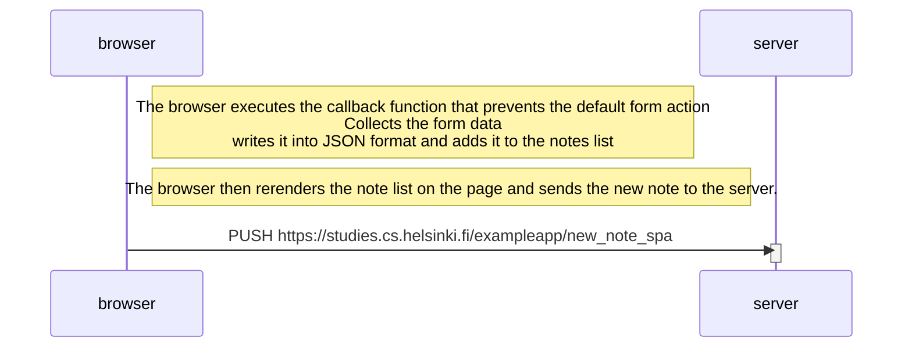

```mermaid
sequenceDiagram
    participant browser
    participant server

    
    Note right of browser: The browser executes the callback function that prevents the default form action<br>Collects the form data<br>writes it into JSON format and adds it to the notes list

     Note right of browser: The browser then  rerenders the note list on the page and sends the new note to the server.

    browser->>server: PUSH https://studies.cs.helsinki.fi/exampleapp/new_note_spa
    activate server
    deactivate server
    

```
